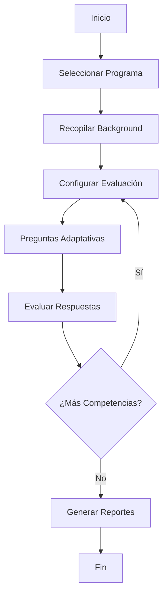

The RAP assessment is a guided, chat-driven process orchestrated by the **VAPAgent** using a [LangGraph](https://langchain-ai.github.io/langgraph/) state machine. Each session progresses through a fixed sequence of steps tracked in the `ConversationState.current_step` field.

## Flow Diagram



## Step-by-Step Walkthrough

<Steps>
  <Step title="Welcome Screen">
    The applicant lands on the **Welcome** page (`/`). A brief introduction to the Valoración de Aprendizajes Previos process is shown alongside Universidad Icesi branding.

    The `ConversationState.current_step` starts as `"welcome"`.

    From here the user navigates to program selection to begin their session.
  </Step>

  <Step title="Program Selection (MasterSelection page)">
    The applicant selects their target master's program at `/master-selection`. The selected program ID is stored in `ConversationState.selected_program_id`.

    The system is currently pre-configured for:

    ```
    program_name = "Maestría en Educación con Énfasis en TIC"
    program_id   = "MEMTIC_2024"
    ```

    <Note>
      The program ID is also read from the `PROGRAM_ID` environment variable, allowing
      different deployments to target different programs without code changes.
    </Note>
  </Step>

  <Step title="Background Collection (Background page)">
    The applicant fills in their professional profile at `/background`. This data is stored in the `ProfessionalBackground` model and attached to the `Applicant` object when the session is first initialized by `VAPAgent._entry_point_router`.

    The following fields are collected:

    | Field | Type | Description |
    |---|---|---|
    | `years_experience` | `int` | Total years of professional experience |
    | `current_position` | `str` | Current job title |
    | `industry` | `str` | Industry or sector |
    | `education_level` | `str` | Highest degree attained |
    | `technical_skills` | `List[str]` | Relevant technical skills |
    | `certifications` | `List[str]` | Professional certifications |
    | `relevant_projects` | `List[str]` | Relevant projects |

    The agent also parses years of experience directly from natural-language messages using a regex pattern (`r'(\d+)\s+años'`), so users can describe their background conversationally.
  </Step>

  <Step title="Chat-Based Assessment (ChatbotVAP page)">
    The core assessment happens at `/chatbot` through the `VAPAgent`. The LangGraph workflow drives the conversation through the following internal nodes:

    | Graph Node | `current_step` value | Purpose |
    |---|---|---|
    | `entry_point` | `welcome` → `competency_evaluation` | Routes new vs. returning users; creates `Applicant` and `Assessment` |
    | `competency_evaluation_step` | `competency_evaluation` | Selects the next question using the adaptive evaluation plan |
    | `answer_evaluation` | `answer_evaluation` | Scores the user's latest response with the LLM (1–5 scale) |
    | `report_generation` | `report_generation` → `end` | Generates the `StudentReport` once 8 questions are answered |

    **Adaptive question selection** is handled by `QuestionBankManager.get_adaptive_evaluation_plan()`, which analyses per-competency performance and assigns remaining questions to under-evaluated competencies first.

    The agent caps the assessment at **8 questions** (`MAX_QUESTIONS = 8`). After this limit, the step transitions automatically to `"report_generation"`.

    <Tip>
      When multiple-choice questions are served the API response includes an `options` array. The
      frontend renders these as clickable answer chips so users do not have to type.
    </Tip>
  </Step>

  <Step title="Evaluation Completion">
    When the answer count reaches `MAX_QUESTIONS`, or when the adaptive plan returns `"complete_assessment"`, the agent appends a completion message and sets:

    ```python
    state.misc["evaluation_complete"] = True
    state.misc["report_generated"]    = True
    state.current_step                = "end"
    ```

    The `ChatResponse` returned to the frontend carries `is_complete=True` and `report_ready=True`, signalling that the UI should redirect to the report view.
  </Step>

  <Step title="Report Generation and Display (Report page)">
    The `ReportGenerator.generate_student_report()` method is called inside `VAPAgent._report_generation_node` with a 100-second timeout. The resulting `StudentReport` is:

    1. Cached in `ConversationState.misc["generated_report"]` to avoid regeneration.
    2. Returned by `GET /api/report/{session_id}` when the frontend polls for the result.

    The applicant is directed to `/report` where the personalised report is displayed, including overall score, strengths, areas to improve, and a recommended learning path.

    <Note>
      If the cached report is available, `GET /api/report/{session_id}` returns it immediately
      without invoking the LLM again.
    </Note>
  </Step>
</Steps>

## Frontend Route Map

The full user journey maps to these React Router routes defined in `App.tsx`:

```
/                   → Welcome
/master-selection   → MasterSelection  (program selection)
/background         → Background       (professional profile)
/chatbot            → ChatbotVAP       (LangGraph-powered chat)
/assessment         → Assessment
/report             → Report           (StudentReport display)
/demo-report/:user  → DemoReport       (pre-built demo personas)
```

<CardGroup cols={2}>
  <Card title="Competency Evaluation" icon="brain" href="/features/competency-evaluation">
    How questions are selected, scored, and mapped to competency levels.
  </Card>
  <Card title="Report Generation" icon="file-chart-column" href="/features/report-generation">
    What the student report contains and how to retrieve it.
  </Card>
</CardGroup>
